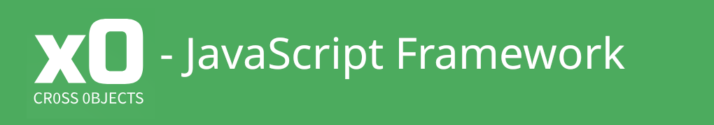

[](https://github.com/WEBcodeX1/x0/actions/workflows/github-code-scanning/codeql)
[](https://github.com/WEBcodeX1/x0/actions/workflows/ci.yml)
[](https://github.com/WEBcodeX1/x0/actions/workflows/dependabot/dependabot-updates)
[](https://github.com/WEBcodeX1/x0/blob/main/LICENSE)
[](https://docs.webcodex.de/x0/v1.0/)

---

Ultra-lightweight JavaScript In-Browser Real-Time Templating Engine - built on exceptionally strong OOP principles

## :pushpin: x0 Framework - Overview

The x0 framework is an **ultra-lightweight**, **serverless** in-browser RTTE (Real-Time Templating Engine) designed to run **entirely independent** of backend or server-side code.
Built on a **clean, object-oriented** programming (OOP) foundation, it **drastically minimizes code complexity** by replacing heavy imperative logic with a highly efficient declarative metadata concept.

The framework can be statically loaded from any standard web server, comprising just 66 system files and 4 object metadata definition files with a core footprint of only 356 Kilobytes.
It depends on `Bootstrap` and optionally utilizes `Font Awesome` for its UI components. Even with a minimalist setup of both libraries, extensive user metadata, and custom application code,
the total deployment size remains under 4 Megabytes for a complete client/server architecture. Because the application renders completely within the client browser,
it is perfectly suited for resource-constrained environments like embedded microcontroller web interfaces.

An example of an x0-application-driven, browser-controlled multiplayer PONG game running on an ESP32-S3 microcontroller using the ESP-IDF framework (with embedded MicroPython) can be found here:
https://github.com/WEBcodeX1/micropython-as

## :pushpin: Key Features & Architecture

* **Declarative Metadata Concept**: Uses modern declarative configurations to define application behavior, drastically reducing custom boilerplate code.
* **Clean OOP Foundation:** Leverages object-oriented design patterns to minimize architectural complexity and keep the codebase maintainable.
* **Serverless & Independent:** Runs entirely in the browser without depending on a classic backend stack.
* **Ultra-Lightweight Core:** Consists of only 66 system files and 4 metadata files, totaling just 356 KB.
* **Production Footprint < 4 MB:** Includes Bootstrap, Font Awesome, and comprehensive user application code within less than 4 Megabytes.
* **Microcontroller Ready:** Ideal for low-resource embedded web interfaces due to full client-side rendering.
* **Modern UI Foundations:** Built on top of Bootstrap with optional, flexible Font Awesome icon support.
* **In-Browser RTTE:** Renders and evolves object-driven interfaces directly in the frontend in real time.
* **Composable Object System:** Combines complex objects into reusable, structured application models using clean OOP abstractions.
* **Multi-Language Ready:** Delivers and maps the same underlying object model across multiple display languages.

---

## :bookmark_tabs: Table of Contents

1. [Quick Start](#racehorse-quick-start)
2. [Features](#star2-features)
3. [Abstract / Purpose](#mega-abstract-purpose)
4. [Single Page Application](#computer-single-page-application)
5. [Documentation](#page_with_curl-documentation)
6. [Simple Usage](#pencil-simple-usage)
7. [Technical Details](#zap-technical-details)
8. [Security](#closed_lock_with_key-security)
9. [Examples](#bulb-examples)
10. [File & Folder Structure](#file_folder-file-folder-structure)
11. [Contributing](#wave-contributing)
12. [Future Plans / Milestones](#alarm_clock-future-plans-milestones)
13. [Community & Support](#globe_with_meridians-community-support)
14. [License](#memo-license)
15. [References](#link-external-references)

---

## :racehorse: Quick Start

Try x0 now in minutes!

```bash
# clone & enter repo
git clone https://github.com/WEBcodeX1/x0.git
cd x0

# install docker
apt-get -y install docker.io docker-buildx

# docker permissions & setup (as root)
usermod -aG docker your-user

# restart (system) and pull pre-built images
docker pull ghcr.io/webcodex1/x0-app
docker pull ghcr.io/webcodex1/x0-db
docker pull ghcr.io/webcodex1/x0-test

# start x0-system
cd ./docker/
./x0-start-containers.sh
```

1. Add to `/etc/hosts`:
```bash
172.20.0.10     x0-app.x0.localnet
```

2. Try hello world:
```
http://x0-app.x0.localnet/python/Index.py
```

3. Try examples:
```
http://x0-app.x0.localnet/python/Index.py?appid=example7
```

Full install details including build instructions: [./INSTALL.md](./INSTALL.md).

---

## :star2: Features

- **Cross Objects:** Clean OOP, seamless data exchange between clients and network
- **Responsiveness:** Bootstrap CSS grid, single app for all devices
- **Object Chaining / Data Abstraction:** Chain objects, enjoy recursive, reusable modeling
- **Zero Code Duplication / Freedom:** OSI-layer abstraction, minimal backend dependencies
- **Kubernetes Ready:** Google Kubernetes Engine (GKE), Minikube support
- **Security:** PKCS-compatible, optional advanced PKI system

Learn more in [Examples](#bulb-examples).

---

## :mega: Abstract / Purpose

**x0** is designed to make advanced SPA development fun, fast, and maintainable. With zero code duplication and a clean OOP model,
**x0** powers complex, modern web applications.

---

## :computer: Single Page Application

Single Page Applications (SPAs) are modern web apps that deliver a seamless,
desktop-like user experience directly in the browser. Unlike traditional multi-page
websites, SPAs dynamically update content without requiring full page reloads, resulting
in faster interactions and smoother navigation.

- **Real-Time Updates:** By using technologies like WebSockets or polling, SPAs can reflect changes instantly — ideal for chat apps, dashboards, or any application requiring live data.
- **Optimized Performance:** Static assets are loaded once, and only data or components needed for each interaction are fetched afterward, reducing bandwidth and latency.

---

## :page_with_curl: Documentation

Rendered docs: [Official Sphinx Documentation](https://docs.webcodex.de/x0/v1.0/).

---

## :pencil: Simple Usage

```javascript
# define object from system objects
let myRootObject1 = new sysBaseObject();
const myObject1 = new sysObjFormfieldItem(JSONConfig);
const myObject2 = new sysObjLink(JSONConfig);
const myObject3 = new sysObjButton(JSONConfig);
myRootObject.addObject(myObject1);
myRootObject.addObject(myObject2);
myRootObject.addObject(myObject3);

# register new system object
sysRegister(myRootObject1, 'MyCoolObject');

# reuse and combine
let myRootObject2 = new sysBaseObject();
const myObject4 = new sysObjMyCoolObject(JSONConfig);
const myObject5 = new sysObjMyCoolObject(JSONConfig);
myRootObject2.addObject(myObject4);
myRootObject2.addObject(myObject5);

# realtime render
myRootObject2.renderObject();
```

---

## :zap: Technical Details

**OS Compatibility:**
- Ubuntu 22.04 (Jammy Jellyfish)
- Ubuntu 24.04 (Noble Numbat)
- Devuan (Daedalus 5.0)

**Prerequisites:**
- Apache2.0+ / WSGI or FalconAS
- PostgreSQL 13+
- Python3+, Psycopg2, Selenium

**Kubernetes:**
- Kubegres: [GitHub](https://github.com/reactive-tech/kubegres)
- Minikube: Partial support on Windows / Linux
- Install Instructions: [./kubernetes/README.md](./kubernetes/README.md)

**Deployment:**
- Linux Standalone
- Docker
- Google Kubernetes Engine (GKE)

---

## :closed_lock_with_key: Security

PKCS 11/15 compatible. Optional advanced PKI (non-free).
Full details in [WEB/codeX PKI Manager](https://www.webcodex.de/index.html?menu=content-projects-wcdx-pkimanager).

---

## :bulb: Examples

Try 15 live examples (after local docker containers have been started):

```
http://x0-app.x0.localnet/python/Index.py?appid=example1
...
http://x0-app.x0.localnet/python/Index.py?appid=example15
```

Most examples now include a descriptive video: [./example/README.md](./example/README.md).

---

## :file_folder: File & Folder Structure

Partial overview, see [GitHub file search](https://github.com/WEBcodeX1/x0/search):

```
├── README.md
├── INSTALL.md
├── debian/
│   └── README.md
├── docker/
│   ├── README.md
│   ├── build-all.sh
│   └── ...
├── doc/
│   ├── index.rst
│   ├── intro.rst
│   ├── dev-examples.rst
│   ├── Makefile
│   └── conf.py
├── example/
│   ├── example1
│   └── example2
├── conf/
│   └── wsgi.conf
├── www/
│   └── sysText.js
├── test/
│   └── README.md
└── ... (more files & folders)
```

---

## :wave: Contributing

Contributions & feedback welcome!
See [./CONTRIBUTING.md](./CONTRIBUTING.md) or open an issue.

---

## :alarm_clock: Future Plans / Milestones

- Replace Apache with FalconAS Python Application Server: [Repo](https://github.com/WEBcodeX1/http-1.2)
- Roadmap: [GitHub Milestones](https://github.com/WEBcodeX1/x0/milestones)

---

## :globe_with_meridians: Community & Support

- [Discussions](https://github.com/WEBcodeX1/x0/discussions)
- [Issues](https://github.com/WEBcodeX1/x0/issues)
- [Docs](https://docs.webcodex.de/x0/v1.0/)

---

## :memo: License

AGPL-3.0. See [./LICENSE](./LICENSE).

---

## :link: External References

- [https://kubernetes.io](https://kubernetes.io)
- [https://www.selenium.dev](https://www.selenium.dev)
- [https://www.kubegres.io](https://www.kubegres.io)
- [https://www.sphinx-doc.org](https://www.sphinx-doc.org)
- [https://www.devuan.org/](https://www.devuan.org/)
- [https://github.com/sl1pm4t/k2tf](https://github.com/sl1pm4t/k2tf)
- [https://github.com/WEBcodeX1/http-1.2](https://github.com/WEBcodeX1/http-1.2)

---

<p align="center"><sub>Made with ❤️ by Claus Prüfer / clickIT / WEBcodeX</sub></p>
