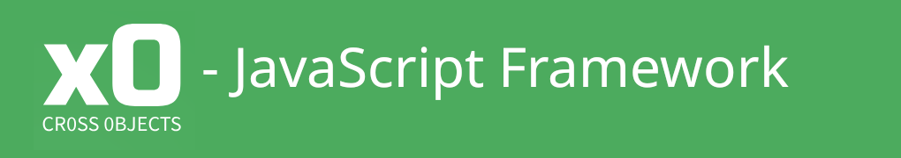

# x0 JavaScript Framework



[](https://github.com/WEBcodeX1/x0/actions/workflows/github-code-scanning/codeql)

## 1. Abstract / Purpose

**x0 (cross-object) JavaScript Framework** /krɒs ɒb.dʒɪkt/ is a modern tool for
building powerful web-browser real-time Single Page Applications (SPAs) efficiently.

For installation instructions, refer to: [./INSTALL.md](./INSTALL.md).<br>
Rendered Sphinx documentation: https://docs.webcodex.de/x0/v1.0/.

## 2. Single Page Application

SPAs are modern browser applications that run *almost* backend-independent, getting
closer to the functionality of *real* desktop apps.

## 3. Quick Start

To see the x0-system in action immediately, download the following Docker images:

- https://docker.webcodex.de/x0/docker.x0-app.tar<br>
- https://docker.webcodex.de/x0/docker.x0-db.tar<br>

```bash
# clone the repository
git clone https://github.com/WEBcodeX1/x0.git
cd x0

# install docker
apt-get -y install docker.io

# set docker permissions / restart shell
usermod -aG docker your-user

# load docker images
docker load < docker.x0-app.tar
docker load < docker.x0-db.tar

# start the x0-system
cd ./docker/
./x0-start-containers.sh
```
Open the URL `http://172.20.0.10/python/Index.py?appid=example12`.

## 4. Cross Objects

What does the "cross" in x0 stand for? **Communication**.

Due to the x0-system's clean OOP model, each object can e"x"change its
data containers internally and over the network between clients *directly*.

See the examples section: [example #10](./example/net_messages/) and
[example #13](./example/copy_paste/) for more information.

## 5. Responsiveness

x0 relies on *Bootstrap CSS*, ensuring cross-browser standards for all end
devices (CSS Grid system).

Build and maintain only **ONE** single app (even for Android) and save on
IT budgets! Additionally, x0 does not rely on Bootstrap or external JavaScript libraries.

## 6. True Object Orientation / Clean Code

JavaScript (ECMA6 / ECMA7) lacks the ability to overload DOM object internal functions,
making it difficult to build clean and efficient abstraction models.

For experienced OOP programmers, this can lead to frustration. x0 solves this problem by
providing **The Missing Layer**, making modeling fun and efficient again.

>[!NOTE]
> Bind your own object methods to existing **DOM elements** and use object inheritance.

## 7. Zero Code Duplication / Freedom

The x0 OSI layer abstraction is simple and relies on **zero** backend dependencies.

In comparison, other SPA frameworks tend to have code duplication by a factor greater than 2.

## 8. Object Chaining / Data Abstraction

A smart base-class design makes object modeling with the x0 framework enjoyable.
Combining (chaining) objects for later reuse (even recursively chainable) is a basic
feature of x0's clean abstraction model.

Feeding objects with data and retrieving data from them (graph-based JSON) saves effort
due to x0's recursive object metadata model. For a better understanding of object modeling
and implementation details, see the Sphinx documentation examples section.

>[!NOTE]
> x0 provides *object instancing* in **runtime** with zero backend communication.

## 9. Kubernetes Ready

*x0-applications* run on Google Kubernetes Engine (GKE).

The JSON-based Kubernetes installer simplifies deploying multiple application
environments quickly.

See [./kubernetes/README.md](./kubernetes/README.md).

>[!NOTE]
> Minikube on Windows and Linux is partially supported.

## 10. Open Source

*x0-system* is licensed under the AGPL-3.0 license.

## 11. Technically

Detailed installation instructions can be found in [./INSTALL.md](./INSTALL.md)
and the subdirectory **README.md** files.

### 11.1. OS Compatibility

*x0-system* runs stably on current Ubuntu Linux 22.04.x LTS (Jammy Jellyfish),
inside local Docker containers, or on native Google Kubernetes Engine (GKE).

>[!NOTE]
> For detailed documentation on setting up on Minikube, see [./kubernetes/README.md](./kubernetes/README.md).

### 11.2. Prerequisites

The following open-source products are required to run the *x0-system*:

- Apache2.0+
- Apache WSGI (Python) **or** FalconAS Application Server
- PostgreSQL 13+
- Python3+
- Psycopg2 (Python) PostgreSQL Client-Library
- Selenium Browser Test-Framework / Python Libraries

### 11.3. Prerequisites Kubernetes

- Kubegres (https://github.com/reactive-tech/kubegres)

### 11.4. Deployment

The *x0-system* can be deployed on the following platforms:

- Linux Standalone
- Docker
- Google Kubernetes Engine (GKE)

## 12. Security

For enhanced security, the *x0-system* is PKCS 11 / PKCS 15 compatible (also on GKE).
Provisioning is managed by its own PKI (Private Key Infrastructure) system (non-free).

## 13. Future Plans / Milestones

>[!NOTE]
> We are currently developing a Python Application Server (FalconAS) to replace Apache
> and the WSGI module.<br> https://github.com/WEBcodeX1/http-1.2.

Milestones are managed on GitHub: https://github.com/WEBcodeX1/x0/milestones.
