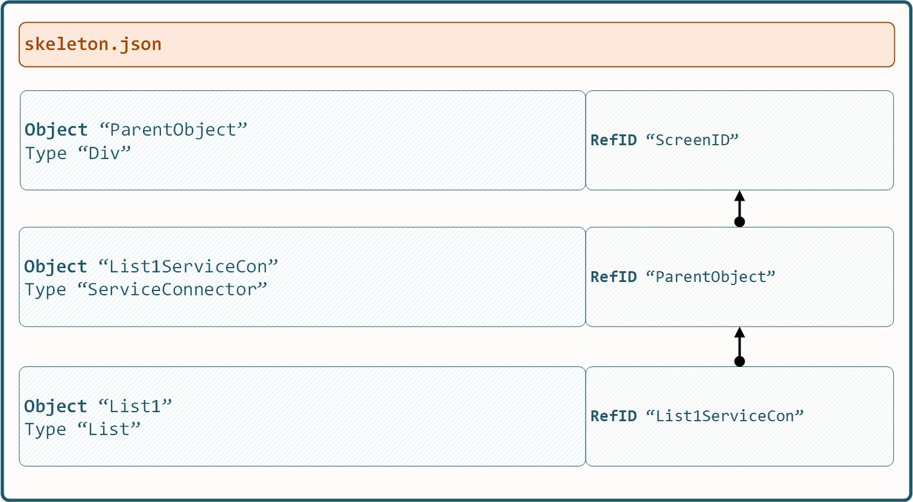

.. appdev-backend

12. Backend / Services
======================

12.1 Intro
----------

To exchange data with backend systems the *x0-system* offers various methods to choose from.

* Service Connector
* Source Data Objects
* Global Data Storage

The next chapters describe all methods in detail and which method is best suited to a
specific application.

12.2 ServiceConnector
---------------------

A ServiceConnector object defines **where** to get the backend data from and **when**.

* Backend Service URL
* Occurring Events which trigger Data Load

Now after a ServiceConnector has been configured in ``object.json``, it must be
*activated* by pointing the DestinationObjects ``RefID`` to the ServiceConnector
ObjectID in ``skeleton.json``.

After it has been *connected*, any systems fired event will cause the connected service
to re-trigger data load.

12.2.1. Object Properties
*************************

.. table:: Object Type Div Attributes
	:widths: 30 20 100

	+---------------------+----------------------+-------------------------------------------------+
	| **Property**        | **Value(s)**         | **Description**                                 |
	+=====================+======================+=================================================+
	| OnEvent             | JS Object            | Event Properties                                |
	+---------------------+----------------------+-------------------------------------------------+

12.2.2. Event Properties
************************

.. table:: Object Type Div Attributes
	:widths: 30 20 100

	+---------------------+----------------------+-------------------------------------------------+
	| **Property**        | **Value(s)**         | **Description**                                 |
	+=====================+======================+=================================================+
	| Events              | Array of EventIDs    | Listen to given Events                          |
	+---------------------+----------------------+-------------------------------------------------+
	| ServiceCall         | Backend Script       | Call Backend Script on raised Event(s)          |
	+---------------------+----------------------+-------------------------------------------------+

12.2.3. object.json
*******************

Define ServiceConnector metadata in ``object.json``.

.. code-block:: javascript

	"TestConnector1":
	{
		"Type": "ServiceConnector",
		"Attributes":
		{
			"OnEvent":
			{
				"Events": [ "TestEvent" ],
				"ServiceCall": "python/getData.py"
			}
		}
	}

12.2.4. skeleton.json
*********************

*Connect* as ParentObject in ``skeleton.json``.

.. code-block:: javascript

	"Screen1":
	[
		{
			"TestConnector1":
			{
				"RefID": "Screen1"
			}
		},
		{
			"TestObject1":
			{
				"RefID": "TestConnector1"
			}
		}
	]

12.3. Source Data Objects
-------------------------

*x0-source-data-objects* feature is a very smart way to control **which** data will be
sent to the backend.

Just reference multiple *x0-system-objects* and its realtime data will be sent to
the backend service.

The following sub-chapters describe how to use SrcDataObjects JSON format in detail.

.. note::

    *x0-source-data-objects* are not only usable in combination with
	service connector, also buttons support the feature.

12.3.1. Global Objects Array
****************************

.. code-block:: javascript

	"SrcDataObjects":
	[
		"ObjectID1",
		"ObjectID2",
		"ObjectID3"
	]

12.3.2. Hardcoded Values
************************

.. code-block:: javascript

	"SrcDataObjects":
	{
		"Dummy":
		{
			"Type": "HardcodedValues",
			"Values": {
				"LimitRows": 20
			}
		}
	}

12.3.3. Global Object
*********************

.. code-block:: javascript

	"SrcDataObjects":
	{
		"$ObjectID":
		{
			"Type": "GlobalObject"
		}
	}

12.3.4. Chaining Object Types
*****************************

.. code-block:: javascript

	"SrcDataObjects":
	{
		"$ObjectID":
		{
			"Type": "GlobalObject"
		},
		"Dummy":
		{
			"Type": "HardcodedValues",
			"Values": {
				"LimitRows": 10
			}
		}
	}

12.4. Global Data
-----------------

It is possible to store global data (var / value pairs) in the following global data spaces:

* Global Data
* Screen Global Data

12.4.1. Load Global Data
************************

*x0-global-data* will be loaded by *x0-preload-script* at *x0-init*.

.. code-block:: sql

	INSERT INTO system.config (app_id, config_group, "value") VALUES ('appid', 'preload_script', '"InitSystem.py"');
	INSERT INTO system.config (app_id, config_group, "value") VALUES ('appid', 'preload_var', '["GlobalVar1"] = "ret_var1"');
	INSERT INTO system.config (app_id, config_group, "value") VALUES ('appid', 'preload_var', '["GlobalVar2"] = "ret_var2"');
	INSERT INTO system.config (app_id, config_group, "value") VALUES ('appid', 'preload_var', '["GlobalVar3"] = "ret_var3"');

12.4.2. Pass Screen Global Data
*******************************

To pass values from *x0-screen-global-data* to backend using *x0-source-data-objects* ...

.. code-block:: javascript

	"SrcDataObjects":
	{
		"$ObjectID":
		{
			"Type": "ScreenGlobalVar",
			"ScreenID": "Screen1"
		}
	}

12.5. Notify Indicator
----------------------

To provide the user with status information (notify) a notification-indicator
per backend service call is configurable.

Add a notify indicator by adding "Notify" attribute to *x0-button-type* like
shown in the following example. 

.. code-block:: javascript

	"ButtonSubmit": {
		"Type": "Button",
		"Attributes": {
			"TextID": "TXT.BUTTON.SUBMIT",
			"Style": "btn btn-primary w-100 mt-3",
			"OnClick": "/python/example-service.py",
			"SrcDataObjects": [
				"FormfieldList1",
				"FormfieldObject1",
				"FormfieldObject2"
			],
			"Notify": {
				"ID": "SubmitIdentifier",
				"DisplayHeaderID": "TXT.NOTIFY.EXAMPLE"
			}
		}
	}

12.6. AAA / Authentication
--------------------------

Currently *x0-system* only supports certificate based (Apache2 / ingress-nginx) 
authentication.

Especially when using decentralized / multiple application servers it is strongly
advised to integrate an external SSO solution.

For authentication to work correctly *x0-preload-script* must be set up
with the correct *x0-preload-vars* ``UserID`` and ``UserSession``.

.. code-block:: sql

	INSERT INTO system.config (app_id, config_group, "value") VALUES ('appid', 'preload_script', '"InitSystem.py"');
	INSERT INTO system.config (app_id, config_group, "value") VALUES ('appid', 'preload_var', '["UserID"] = "ret_user_id"');
	INSERT INTO system.config (app_id, config_group, "value") VALUES ('appid', 'preload_var', '["UserSession"] = "ret_user_session"');

Internally *x0-system* authentication data will be stored in the following global variables.

.. code-block:: javascript

	sysFactory.sysUserID
	sysFactory.sysSessionValue

.. warning::

    Also *x0-messaging* component relies on setting ``UserSession`` the correct way.
