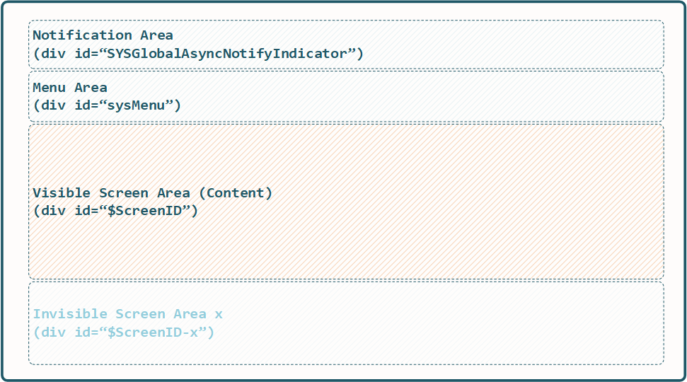
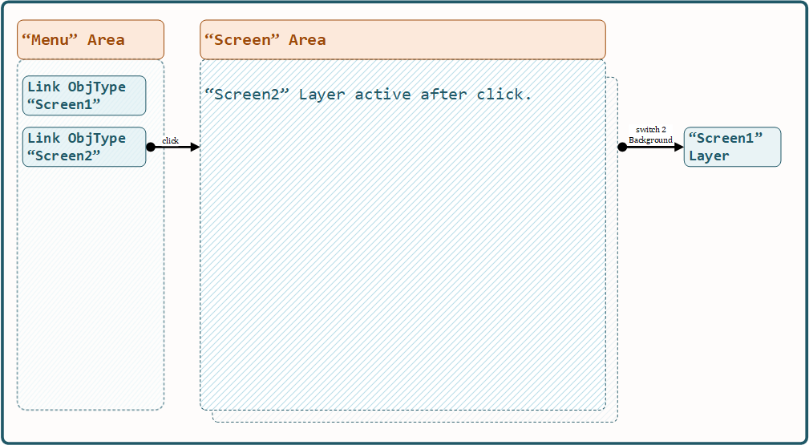

.. _appdevconfig:

3. Basic Configuration
======================

The following sections describe the most important system parts.

* Browser Content Areas / Screen Definition
* System Database Configuration Data
* Web-Application Server Configuration (app-config.json)
* Application Metadata / Objects and Objects Reference Configuration

3.1. Browser Content Areas
--------------------------

The *x0-systems* browser main display area is devided into **3 visible** areas.

1. "Menu" Area
2. "Screen" Content Area
3. "Notification" Area

.. note::

    Note the invisible screen layers. Details following.

3.1.1. Menu Area
****************

The **x0-menu-area** is primarily intended to contain menu related *x0-objects*
/ internal links.

The DOM DIV layer id = `sysMenu`. Referenced *x0-objects* inside **menu.json**
will be appended to `sysMenu`` DIV on system init rendering / page load.

A **x0-screen** (textual id) can be referenced by a link *x0-object-type*. When
clicked, the system ativates / makes the screen layer visible within the
**x0-screen-area**.

DOM Layer positioning can be achieved via CSS styles, detailed info about
content area positioning, see :ref:`content-area-positioning`.

.. note::

    The **x0-menu-area** is not only limited to *x0-object-type* link only, any
    *x0-object* can be referenced in **menu.json**, e.g. as **object container**
    used for positioning.

3.1.2. Screen Area
******************

The **x0-screen-area** acts as the main content display area.

The **default_screen** which will be activated on system init / page load can
be set by *x0-config-parameter* (details see :ref:`systemconfig`).

Screen definition and object relations will be defined inside **skeleton.json**
(details see :ref:`skeleton-json`).

Also DOM Layer positioning can be achieved via CSS styles, detailed info about
content area positioning, see :ref:`content-area-positioning`.

The following diagram shows what exactly happens on *x0-screen-switch*.

3.1.3. Notification Area
************************

The **x0-notification-area** displays web-service status information when
data is exchanged with the backend or on external web-service calls.

Also DOM Layer Positioning can be achieved via CSS styles, detailed info about
content area positioning, see :ref:`content-area-positioning`.

3.1.4. Object State Preservation
********************************

The *x0-system* guarantees 100% content state preservation on any systems
interaction (button, screen or tab switch, page navigation).

Even combined / chanined realtime objects always preserve their state
thanks to the *x0-systems-design*.

Imagine, if you switch from screen with id "screen1" to "screen2" e.g., do some
work, switch back to "screen1", any object look including its data is exactly
in the state it had been before switching.

.. note::

    This is real cool, never loose any user input data on "going back" actions
    again!

.. _content-area-positioning:

3.1.5. Area Positioning / CSS
*****************************

Styling including positioning **x0-menu-area** and **x0-screen-area** and
**x0-notification-area** using Boostrap Grid CSS is conceivable simple.

You should be familiar with CSS Grid basics and Boostrap Grid feature,
see https://getbootstrap.com/docs/5.3/layout/grid/.

Currently the **x0-menu-area** gets positioned by using ``position: absolute``
and **x0-screen-area** by ``
``.

A better approach is to use ``<body class="row">`` and ``col-md-x`` CSS classes
on **x0-menu-area** and **x0-screen-area**.

Positioning **x0-notification-area** using ``position: absolute`` could be a
really good idea.

.. note::

    CSS styles in 2025 are tremendously flexible. Bootstrap in addition reduces
    this complexity and makes using *x0-system* effortlessly.

3.2. Database Configuration
---------------------------

Basic *x0-application* configuration data will be stored inside the following
system tables **system.config** and **webui.text**.

The following described meta-data **must** exist for an *x0-application* to work
properly.

The sql scripts (filename suffix **.sql**)  must reside in **/database** folder
of *x0-system* **or** *x0-skeleton*.

System database will be updated from **.sql** scripts inside **/database** folder
on docker image re-build (see subsection  ... appdev-deployment::docker ... ).

.. _systemconfig:

3.2.1. System Configuration
***************************

*x0-systems-configuration* data is stored in database table `system.config`.

.. table:: System Database Table "system.config"
    :widths: 20 30 100

    +----------------------+-----------------+-------------------------------------+
    | **Table Column**     | **Default**     | **Description**                     |
    +======================+=================+=====================================+
    | app_id               | 'default' (str) | x0 Application ID                   |
    +----------------------+-----------------+-------------------------------------+
    | config_group         |                 | Configuration Parameter ID          |
    +----------------------+-----------------+-------------------------------------+
    | "value"              |                 | Configuration Parameter Value       |
    +----------------------+-----------------+-------------------------------------+

.. table:: Configuration Parameter "x0-config-parameter"
    :widths: 20 30 50

    +----------------------+-----------------+-------------------------------------+
    | **Parameter**        | **Type**        | **Description**                     |
    +======================+=================+=====================================+
    | index_title          | String          | x0 Browser Page Title               |
    +----------------------+-----------------+-------------------------------------+
    | debug_level          | Integer         | System Debug Level                  |
    +----------------------+-----------------+-------------------------------------+
    | display_language     | 'en' | 'de'     | System Display Language             |
    +----------------------+-----------------+-------------------------------------+
    | default_screen       | String          | Screen ID Reference                 |
    +----------------------+-----------------+-------------------------------------+
    | parent_window_url    | String (URL)    | Wordpress Plugin Parent URL         |
    +----------------------+-----------------+-------------------------------------+
    | subdir               | String (Path)   | "static" Backend Path               |
    +----------------------+-----------------+-------------------------------------+
    | config_file_menu     | String (File)   | Override Menu Config Data Filename  |
    +----------------------+-----------------+-------------------------------------+
    | config_file_object   | String (File)   | Override Menu Config Data Filename  |
    +----------------------+-----------------+-------------------------------------+
    | config_file_skeleton | String (File)   | Override Menu Config Data Filename  |
    +----------------------+-----------------+-------------------------------------+

The following example sql inserts demonstrate a default *x0-application-config*
viewable by URL http://x0-app.x0.localnet/python/Index.py.

.. code-block:: sql

    INSERT INTO system.config (config_group, "value") VALUES ('index_title', 'x0 Default App');
    INSERT INTO system.config (config_group, "value") VALUES ('debug_level', '10');
    INSERT INTO system.config (config_group, "value") VALUES ('display_language', 'en');
    INSERT INTO system.config (config_group, "value") VALUES ('default_screen', 'Screen1');
    INSERT INTO system.config (config_group, "value") VALUES ('parent_window_url', 'null');
    INSERT INTO system.config (config_group, "value") VALUES ('subdir', '/static');
    INSERT INTO system.config (config_group, "value") VALUES ('config_file_menu', 'menu.json');
    INSERT INTO system.config (config_group, "value") VALUES ('config_file_object', 'object.json');
    INSERT INTO system.config (config_group, "value") VALUES ('config_file_skeleton', 'skeleton.json');

3.2.2. Display Text
*******************

Multilanguage display text is stored inside ``webui.text`` database table.

The following example inserts 4 multilanguage texts with IDs ``TXT.TEXTID.1``
and ``TXT.TEXTID.2`` (english and german) into the system text table which can
be referenced in *x0-object-metadata* JSON configuration files later on.

.. code-block:: sql

    INSERT INTO webui.text 
    (id, "group", value_en, value_de)
    VALUES
    ('TXT.TEXTID.1', 'group1', 'English Text #1', 'German Text #1');

    INSERT INTO webui.text
    (id, "group", value_en, value_de)
    VALUES
    ('TXT.TEXTID.2', 'group1', 'English Text #2', 'German Text #2');

3.2.3. Application ID
*********************

It is possible to append HTTP get parameter ``appid`` with e.g. ``example2``
to the base URL (Index.py) script.

http://x0-app.x0.localnet/python/Index.py?appid=example2

The following sql statements show how configuration data must be stored for this
to work properly.

.. code-block:: sql

    INSERT INTO system.config (app_id, config_group, "value") VALUES ('example2', 'index_title', 'x0 Example Basic-Menu-Screen');
    INSERT INTO system.config (app_id, config_group, "value") VALUES ('example2', 'debug_level', '10');
    INSERT INTO system.config (app_id, config_group, "value") VALUES ('example2', 'display_language', 'en');
    INSERT INTO system.config (app_id, config_group, "value") VALUES ('example2', 'default_screen', 'Screen1');
    INSERT INTO system.config (app_id, config_group, "value") VALUES ('example2', 'parent_window_url', 'null');
    INSERT INTO system.config (app_id, config_group, "value") VALUES ('example2', 'subdir', '/examples/basic_menu_screen');
    INSERT INTO system.config (app_id, config_group, "value") VALUES ('example2', 'config_file_menu', 'menu.json');
    INSERT INTO system.config (app_id, config_group, "value") VALUES ('example2', 'config_file_object', 'object.json');
    INSERT INTO system.config (app_id, config_group, "value") VALUES ('example2', 'config_file_skeleton', 'skeleton.json');

3.3. App Configuration
----------------------

Inside ``/config/app-config.json`` configuration file the following elements
can be defined.

* Database Authentication
* Virtual Hosts
* x0-Applications

.. note::

    Setup multiple Virtual Hosts and x0-Applications requires valid
    *x0-systems-configuration* (db) and *x0-deb-packaging-setup* (deb)
    for all configured Virtual Hosts.

.. warning::

    Also Environments are not supported by *x0-standalone* or *x0-docker*
    deployments.

3.3.1. Database Authentication
******************************

The following database users will be created on docker *x0-db* image build.

.. table:: Database Authentication Properties
    :widths: 30 20 50

    +-------------------------------+-----------------+-------------------------------------+
    | **Database User**             | **DB User**     | **Description**                     |
    +===============================+=================+=====================================+
    | su_password                   | postgres        | Database Superuser Auth PWD         |
    +-------------------------------+-----------------+-------------------------------------+
    | x0_password                   | x0              | Global Web-Backend User Auth PWD    |
    +-------------------------------+-----------------+-------------------------------------+
    | repl_password                 | replication     | Kubegres Replication User Auth PWD  |
    +-------------------------------+-----------------+-------------------------------------+

3.3.2. Virtual Hosts
********************

For each Virtual Host configured in JSON "vhosts" property a Apache Virtual
Host will be generated on docker (re-)build.

Self signed SSL certificates will be generated for the *x0-base* VirtualHost
(Hello World output).

.. note::

    A working multi VirtualHosts setup needs correct metadata defined inside
    deb package ``$x0-app-id.install``. Details: :ref:`appdeployment-standalone`.

.. note::

    If you need a more complex webserver setup, e.g. aliasing / redirects or similar,
    it is intended to manually edit the generated config inside docker containers after
    building.

.. warning::

    Automated SSL setup per VHost has been dropped in *x0-standalone* and *x0-docker*
    deployments. Only *x0-kubernetes* deployment supports a fully automated workflow.

3.3.3. x0-Applications
**********************

Defining multiple *x0-applications* is only supported by *x0-kubernetes* deployment.
Details: :ref:`appdeployment-kubernetes`.

3.3.4. Default Config
*********************

Following, the *x0-systems* current default configuration.

.. code-block:: javascript

    {
        "installer": {
            "type": "x0"
        },
        "database": {
            "name": "x0",
            "su_password": "changeme",
            "x0_password": "changeme"
        },
        "env_list": [ "default" ],
        "vhosts": {
            "x0-app": {
                "apps": [ "x0" ],
                "env": {
                    "default": {
                        "dns": {
                            "hostname": "x0-app",
                            "domain": "x0.localnet"
                        }
                    }
                }
            }
        }
    }

3.3.4. JSON Schema
******************

1. JSON Header

.. table:: JSON Header
	:widths: 30 20 50

	+---------------------+----------------------+-------------------------------------------------+
	| **Property**        | **Type**             | **Description**                                 |
	+=====================+======================+=================================================+
	| installer.type      | Enum String          | Installer Type                                  |
	+---------------------+----------------------+-------------------------------------------------+
	| env_list            | Array of EnvString   | Environment List                                |
	+---------------------+----------------------+-------------------------------------------------+

2. "vhosts" Property

.. table:: "vhosts" Property
	:widths: 30 20 50

	+---------------------+----------------------+-------------------------------------------------+
	| **Property**        | **Type**             | **Description**                                 |
	+=====================+======================+=================================================+
	| vhosts              | Object of VHElements | Virtual Host Elements / Configuration           |
	+---------------------+----------------------+-------------------------------------------------+

3. $VhostConfig "apps" Property

.. table:: $VhostConfig "apps" Property
	:widths: 30 20 50

	+---------------------+----------------------+-------------------------------------------------+
	| **Property**        | **Type**             | **Description**                                 |
	+=====================+======================+=================================================+
	| apps                | Array of AppString   | Application List                                |
	+---------------------+----------------------+-------------------------------------------------+
	| env                 | Object               | Environment Elements                            |
	+---------------------+----------------------+-------------------------------------------------+

4. Env Properties

.. table:: Env Properties
	:widths: 30 20 50

	+---------------------+----------------------+-------------------------------------------------+
	| **Property**        | **Type**             | **Description**                                 |
	+=====================+======================+=================================================+
	| dns.hostname        | Host String          | DNS Hostname used for hostname.domain FQDN      |
	+---------------------+----------------------+-------------------------------------------------+
	| dns.domain          | Domain String        | DNS Domain used for hostname.domain FQDN        |
	+---------------------+----------------------+-------------------------------------------------+

3.4. System Metadata
--------------------

With help of the **x0-system-metadata** JSON configuration files any objects
structure and objects relation will be defined.

The example section `/examples` also can help to get a better understanding how
object definition and object relation is setup correctly.

.. _object-json:

3.4.1. Object
*************

*x0-object* declaration takes place in ***object.json*** config file.

Each object must have its unique ID and is referencable by its ID inside
**menu.js** and **skeleton.js** config files.

All current usable *x0-system-objects* JSON definitions ($ObjectType) are
described in detail here: :ref:`system-objects`.

.. code-block:: javascript

    {
        "$ObjectID": {
            "Type": String::$ObjectType
            "Attributes": {
                Object::$ObjectMetadata
            }
        }
    }

.. note::

    The JSON root type is *Object* type, **not** *Array*. Object definition does
    not rely on order. Relations do rely strict on order and are defined in
    ``skeleton.json`` and ``menu.json``.

.. _skeleton-json:

3.4.2. Skeleton
***************

*x0-screen** and *x0-object* relation declaration takes place in **skeleton.json**
config file.

* Screen Data
* Screen / Objects Relation

The following metadata enables 3 Screens "Screen1", "Screen2" and "Screen3"
without any objects relation.

.. code-block:: javascript

    {
        "Screen1":
        [
            {}
        ],
        "Screen2":
        [
            {}
        ],
        "Screen3":
        [
            {}
        ]
    }

The following metadata defines 1 Screen "Screen1" and references 1 object to
"Screen1".

.. code-block:: javascript

    {
        "Screen1":
        [
            {
                "Object1":
                {
                    "RefID": "Screen1"
                }
            }
        ]
    }

The following metadata defines 1 Screen "Screen1" and references 1 object to
"Screen1". Also "Object2" is **connected** / referenced to "Object1".

.. code-block:: javascript

    {
        "Screen1":
        [
            {
                "Object1":
                {
                    "RefID": "Screen1"
                },
                "Object2":
                {
                    "RefID": "Object1"
                }
            }
        ]
    }

.. _menu-json:

3.4.3. Menu
***********

Declaration inside **menu.json** config file only references object data to
the **x0-menu-area**. The syntax is the same like **skeleton.json** except that
the root ``RefID`` property must be set to "sysMenu".

The following metadata defines two objects "Object1" and "Object2". "Object1" is 
connected to menu root. Also "Object2" is **connected** / referenced to "Object1".

.. code-block:: javascript

    {
        {
            "Object1":
            {
                "RefID": "sysMenu"
            },
            "Object2":
            {
                "RefID": "Object1"
            }
        }
    }

3.5. Metadata ElementID
-----------------------

Some *x0-objects* define elements inside **object.json**.

* TabContainer

These elements are also referencable inside **skeleton.json** by *x0-systems*
``ElementID`` property.

3.5.1. Example
**************

The following example shows how to reference *x0-tabs* defined in **object.json**
inside **skeleton.json**.

Example #3 (http://x0-app.x0.localnet/python/Index.py?appid=example3) provides
a running example.

**object.json**

.. code-block:: javascript

    {
        "TabContainer1":
            {
                "Type": "TabContainer",
                "Attributes":
                {
                    "Tabs": [
                        {
                            "ID": "Tab1",
                            "Attributes":
                                {
                                    "Default": true,
                                    "TextID": "TXT.BASIC-TABCONTAINER.TAB1",
                                    "Style": "col-md-4"
                                }
                        },
                        {
                            "ID": "Tab2",
                            "Attributes":
                                {
                                    "TextID": "TXT.BASIC-TABCONTAINER.TAB2",
                                    "Style": "col-md-8"
                                }
                        }
                    ]
                }
            }
        }
    }

**skeleton.json**

.. code-block:: javascript

    {
        "Screen1":
        [
            {
                "TabContainer1":
                {
                    "RefID": "Screen1"
                }
            },
            {
                "Text1":
                {
                    "RefID": "TabContainer1",
                    "ElementID": "Tab1"
                }
            },
            {
                "Text2":
                {
                    "RefID": "TabContainer1",
                    "ElementID": "Tab2"
                }
            }

        ]
    }

3.6. Object Templates
---------------------

To integrate user based *x0-object-templates* (programmed user based *x0-system-objects*)
``template_file`` and ``setup_class`` config parameters have to be specified.

.. code-block:: sql

    INSERT INTO system.config (app_id, config_group, "value") VALUES ('appid', 'template_file', 'TemplateObject1.js');
    INSERT INTO system.config (app_id, config_group, "value") VALUES ('appid', 'template_file', 'TemplateObject2.js');
    INSERT INTO system.config (app_id, config_group, "value") VALUES ('appid', 'template_file', 'TemplateObject3.js');
    INSERT INTO system.config (app_id, config_group, "value") VALUES ('appid', 'setup_class', '["TemplateClass"] = TemplateClass');
    INSERT INTO system.config (app_id, config_group, "value") VALUES ('appid', 'setup_class', '["TemplateClassOther"] = TemplateClassOther');
    INSERT INTO system.config (app_id, config_group, "value") VALUES ('appid', 'setup_class', '["TemplateClassInfo"] = TemplateClassInfo');

Template .js files must be placed in *x0-application* ``/static`` subdir to be loaded correctly.

Howto model *x0-system-objects* in detail, see :ref:`devobjectmodeling`.
