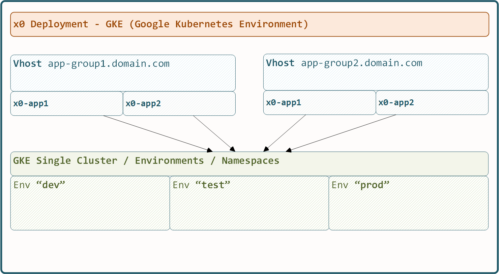

.. appdev-deployment

21. Deployment
==============

21.1. Intro
-----------

The *x0-deployment* main goal is to get multiple production ready GKE
(Google Kubernetes Engine) environments online with minimum effort.

Why Kubernetes? It is the only current system worldwide guaranteeing
native fail-safe operations including application load-balancing and
auto-scaling.

Following, our proposed deployment workflow.

* Run & Test Application in Docker Environment (x0-supported)
* Deploy on Kubernetes Minikube (x0-supported)
* Deploy to GKE Production Cluster (x0-supported)
* Terraform Convert Metadata (x0-supported)
* Takeover Lifecycle / DevOps Management by Terraform or similar

.. _appdeployment-standalone:

21.2. Standalone
----------------

Standalone installation provides packages for Ubuntu 22.04.

If you really like to run packages natively, install *x0-app* and *x0-db*
.deb packages. Using the Docker environment is strongly recommended to avoid
unnecessary effort.

.. code-block:: bash

	dpkg -i x0-db_1.0_all.deb
	dpkg -i x-app_1.0_all.deb

.. _appdeployment-docker:

21.3. Docker
------------

The *x0-docker-environment* is primarily intended to test your application
locally before more time-consuming Kubernetes administration tasks apply.

A Minikube deployment also includes infrastructural / loadbalancing tests
to ensure your application also behaves correctly on GKE.

.. _appdeployment-tests:

21.4. Test Image / Container
----------------------------

To run tests transparently on any environment, the *x0-infrastructure* is
completely dockerized.

The following steps will run all system tests:

* Start Application Containers (x0-app, x0-db)
* Start Selenium Server Container
* Start Test-Runner Container

.. code-block:: bash

	# start x0-app, x0-db containers
	cd ./docker && ./x0-start-containers.sh

	# start x0-app, x0-db containers
	cd ../test
	python3 ./run-selenium-server.py
	sleep 10 && ./run-test-container.sh

21.5. Docker on Windows
-----------------------

* Final built images / containers also **run** on Windows 11 (Docker Desktop)
* Building on Windows 11 (Docker Desktop) is not possible

.. _appdeployment-kubernetes:

21.6. Kubernetes
----------------

The kubernetes installer will set up the following, depending on the
configuration.

* Kubegres / Multi-Pod PostgreSQL Database
* Multi-Pod x0-application
* Ingress-nginX Application Load-Balancing

It will set up multiple environments in different GKE namespaces with
configurable DNS host / domain based Virtual Hosts and *x0-applications*.

* Environments
* Virtual Hosts
* x0-Applications

The kubernetes installer is located at ``/kubernetes/setup/Setup.py``.

Regardless of developing *x0-base* or your own app (*x0-skeleton*), the first step
to check if your application runs on GKE is starting the setup for Minikube.

.. code-block:: javascript

	{
		"installer": {
			"type": "x0",
			"subtype": "minikube",
			"os": "mswindows",
			"os_version": 11
		}
	}

.. code-block:: bash

	# change to setup
	cd ./kubernetes/setup/

	# run installer
	python3 ./Setup.py

21.6.1. Base Properties
***********************

Root properties.

.. table:: Base Properties
	:widths: 30 20 50

	+---------------------+----------------------+-------------------------------------------------+
	| **Property**        | **Type**             | **Description**                                 |
	+=====================+======================+=================================================+
	| project             | Object               | Project Properties (name, id, git-repo)         |
	+---------------------+----------------------+-------------------------------------------------+
	| installer           | Object               | Installer Properties (type)                     |
	+---------------------+----------------------+-------------------------------------------------+
	| database            | Object               | Database Authentication Properties              |
	+---------------------+----------------------+-------------------------------------------------+
	| env_list            | Array of EnvStrings  | Environments List                               |
	+---------------------+----------------------+-------------------------------------------------+
	| environments        | Object               | Environments Objects Declaration                |
	+---------------------+----------------------+-------------------------------------------------+
	| vhosts              | Object               | VHosts Object Declaration                       |
	+---------------------+----------------------+-------------------------------------------------+

21.6.2. Project Properties
**************************

Project related properties.

.. table:: Setup Base Properties
	:widths: 30 20 50

	+---------------------+----------------------+-------------------------------------------------+
	| **Property**        | **Type**             | **Description**                                 |
	+=====================+======================+=================================================+
	| name                | Identifier String    | Project Name                                    |
	+---------------------+----------------------+-------------------------------------------------+
	| id                  | Identifier String    | Project ID (If different ID from name wanted)   |
	+---------------------+----------------------+-------------------------------------------------+
	| git-repo            | Git-Repo String      | Git Repository (Docker Registry Ref)            |
	+---------------------+----------------------+-------------------------------------------------+

21.6.3. Installer Properties
****************************

Installer related properties.

.. table:: Setup Installer Properties
	:widths: 30 20 50

	+---------------------+----------------------+-------------------------------------------------+
	| **Property**        | **Type**             | **Description**                                 |
	+=====================+======================+=================================================+
	| type (installer)    | Enum InstallerString | "x0" or "debian-package" or "default"           |
	+---------------------+----------------------+-------------------------------------------------+

21.6.4. Database Properties
***************************

Database related properties.

.. table:: Setup Database Properties
	:widths: 30 20 50

	+---------------------+----------------------+-------------------------------------------------+
	| **Property**        | **Type**             | **Description**                                 |
	+=====================+======================+=================================================+
	| name                | String               | Main System Database Name                       |
	+---------------------+----------------------+-------------------------------------------------+
	| su_password         | DB-Password String   | Postgres Super User Password                    |
	+---------------------+----------------------+-------------------------------------------------+
	| x0_password         | DB-Password String   | Web Application User Password used by x0 App    |
	+---------------------+----------------------+-------------------------------------------------+
	| repl_password       | DB-Password String   | Kubergres Replication Password                  |
	+---------------------+----------------------+-------------------------------------------------+

21.6.5. Environment Element
***************************

Environment Element related properties.

.. table:: Setup Environment Element Properties
	:widths: 30 10 60

	+-----------------------------------------+----------------------+---------------------------------------+
	| **Property**                            | **Type**             | **Description**                       |
	+=========================================+======================+=======================================+
	| $env.kubernetes                         | Object               | Kubernetes Environment ID             |
	+-----------------------------------------+----------------------+---------------------------------------+
	| $env.kubernetes.deployment              | Object               | Deployment Properties                 |
	+-----------------------------------------+----------------------+---------------------------------------+
	| $env.kubernetes.deployment.image        | String               | Docker Image ID                       |
	+-----------------------------------------+----------------------+---------------------------------------+
	| $env.kubernetes.deployment.replicas     | Integer              | Pods Replica Count                    |
	+-----------------------------------------+----------------------+---------------------------------------+
	| $env.kubernetes.deployment.cpu          | String               | CPU Percentage                        |
	+-----------------------------------------+----------------------+---------------------------------------+
	| $env.kubernetes.deployment.memory       | String               | Memory Amount                         |
	+-----------------------------------------+----------------------+---------------------------------------+
	| $env.kubernetes.deployment.autoscale    | Boolean              | Autoscaling Active                    |
	+-----------------------------------------+----------------------+---------------------------------------+
	| $env.database                           | Object               | Database Pod Properties               |
	+-----------------------------------------+----------------------+---------------------------------------+
	| $env.database.size                      | String               | Single Pod Size                       |
	+-----------------------------------------+----------------------+---------------------------------------+
	| $env.database.replicas                  | Integer              | Pods Replica Count                    |
	+-----------------------------------------+----------------------+---------------------------------------+

21.6.6. VirtualHost Element
***************************

.. table:: Set up VirtualHost Element Properties
	:widths: 30 10 60

	+-----------------------------------------+----------------------+---------------------------------------+
	| **Property**                            | **Type**             | **Description**                       |
	+=========================================+======================+=======================================+
	| $vhost.apps                             | Array of AppStrings  | List of x0-Applications               |
	+-----------------------------------------+----------------------+---------------------------------------+
	| $vhost.env                              | Object               | Environments Config                   |
	+-----------------------------------------+----------------------+---------------------------------------+
	| $vhost.env.$env                         | Object               | Environment ID                        |
	+-----------------------------------------+----------------------+---------------------------------------+
	| $vhost.env.$env.dns                     | Object               | DNS Properties                        |
	+-----------------------------------------+----------------------+---------------------------------------+
	| $vhost.env.$env.dns.hostname            | String               | DNS Hostname                          |
	+-----------------------------------------+----------------------+---------------------------------------+
	| $vhost.env.$env.dns.domain              | String               | DNS Domain                            |
	+-----------------------------------------+----------------------+---------------------------------------+
	| $vhost.env.$env.ip                      | Object               | IP Properties                         |
	+-----------------------------------------+----------------------+---------------------------------------+
	| $vhost.env.$env.ip.v4.dns_register      | Boolean              | IPv4 Register DNS                     |
	+-----------------------------------------+----------------------+---------------------------------------+
	| $vhost.env.$env.ip.v4.dns_register_type | String               | IPv4 Register DNS Type                |
	+-----------------------------------------+----------------------+---------------------------------------+
	| $vhost.env.$env.tls                     | Object               | TLS Properties                        |
	+-----------------------------------------+----------------------+---------------------------------------+
	| $vhost.env.$env.tls.certs               | Object               | Certificate Properties                |
	+-----------------------------------------+----------------------+---------------------------------------+
	| $vhost.env.$env.tls.certs.ca-cert       | CertID-String        | CA Cert Reference                     |
	+-----------------------------------------+----------------------+---------------------------------------+
	| $vhost.env.$env.tls.certs.cert          | CertID-String        | Cert Reference                        |
	+-----------------------------------------+----------------------+---------------------------------------+
	| $vhost.env.$env.tls.certs.key           | CertID-String        | Cert Private Key Reference            |
	+-----------------------------------------+----------------------+---------------------------------------+
	| $vhost.env.$env.tls.verify-client-certs | Boolean              | Ingress-nginx Verify Client Certs     |
	+-----------------------------------------+----------------------+---------------------------------------+
	| $vhost.env.$env.loadbalancer            | Object               | Loadbalancer (ingress-nginx)          |
	+-----------------------------------------+----------------------+---------------------------------------+
	| $vhost.env.$env.loadbalancer.ref        | String               | Ingress Reference                     |
	+-----------------------------------------+----------------------+---------------------------------------+
	| $vhost.env.$env.loadbalancer.paths      | Array of Strings     | List of Ingress Paths                 |
	+-----------------------------------------+----------------------+---------------------------------------+
	| $vhost.env.$env.whitelist-source        | IPv4Net-String       | Whitelist IP / Subnet                 |
	+-----------------------------------------+----------------------+---------------------------------------+
