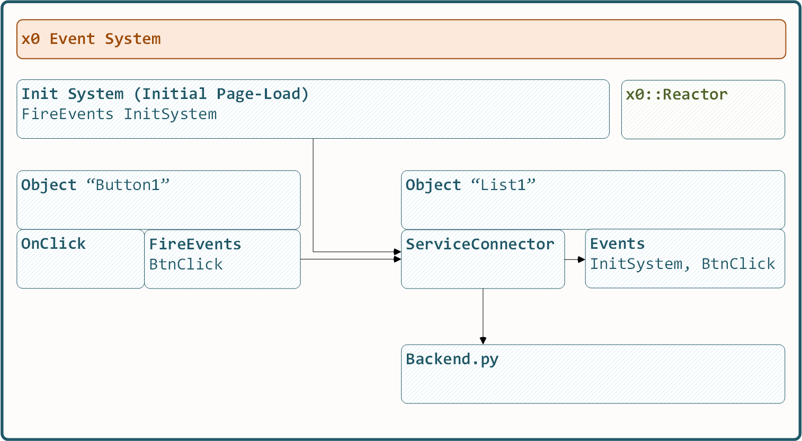

.. appdev-event-system

8. Event-System
===============

Any object getting backend data via ServiceConnector is able to receive *x0-events*

An object can register to multiple *x0-events*.

On *x0-init* (initial page load) the ``"InitSystem"`` event is fired.

If re-trigger data load. Some object types will be re-rendered on , e.g. List
which will be removed from DOM and newly rendered.

The following object types support raising events.

* Button
* ButtonInternal
* Link

9. Control Flow Items
=====================

The next sub-chapters describe ... which properties ...

7.1. Button
-----------

* Backend Service Excecution
* Fire Events *after* successful Form Validation
* Fire Events *after* successful Service Excecution

7.2. ButtonInternal
-------------------

* No Backend Service Excecution
* Form Validation
* Fire Events *after* on successful Form Validation

7.3. Link
---------

* Set Screen CSS Style
* Switch Screen
* Open Screen Overlay
* Fire Events

7.4. LinkExternal
-----------------

* Open External Link Only
