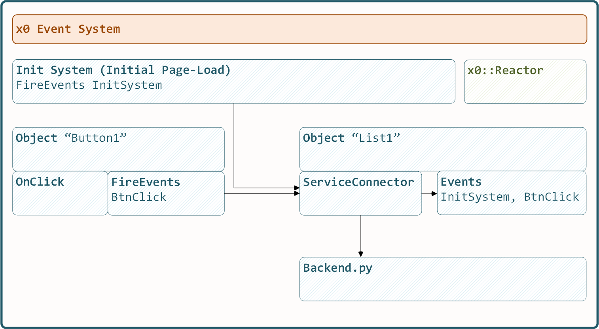

.. appdev-event-system

.. _appdeveventsystem:

15. Event-System
================

15.1. Intro
-----------
Any *x0-system-object* getting backend data via *x0-service-connector* method
is able to receive *x0-system-events*.

Any *x0-system-object* is able to register to multiple *x0-events*.
During x0-init (initial page load), the ``InitSystem`` *x0-system-event* is triggered /
fired.

.. note::

    Some *x0-object-types*, e.g., the **List** object will be completely removed from
    the DOM and re-rendered by invoking ``callbackXMLRPCAsync()`` method.

15.2. Raising Events
--------------------

Buttons and internal buttons can raise configured events.

* Button
* ButtonInternal

.. _appdevcontrolflow:

16. Control Flow Items
======================

The next sub-chapters describe the logical control-flow and in which order
they are processed.

.. _appdevcontrolbutton:

16.1. Button
------------

* Backend Service Execution
* Execute Action **after** successful Form Validation 
* Fire Events **after** successful Form Validation
* Execute OnResult Actions **after** successful Service Execution
* Fire Events **after** successful Service Execution

.. _appdevcontrolbuttoninternal:

16.2. ButtonInternal
--------------------

* No Backend Service Execution
* Form Validation
* Execute Action **after** successful Form Validation 
* Fire Events **after** successful Form Validation

.. _appdevcontrollink:

16.3. Screen and Overlay Actions
--------------------------------

Use button actions to change screens or open overlays. The legacy ``Link`` and
``LinkExternal`` object types are not part of the current runtime object
registry; use supported button actions for in-application control flow.
