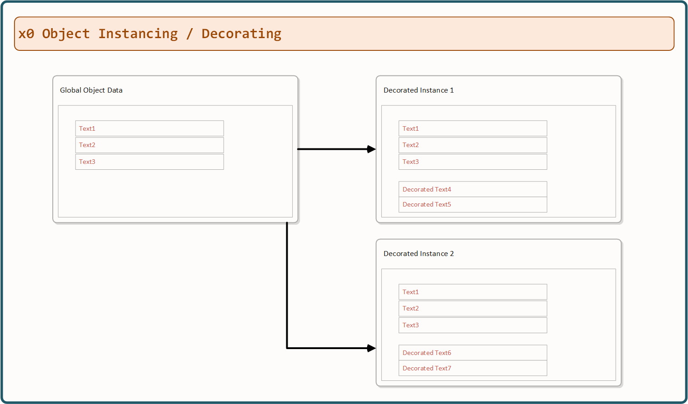

.. appdev-overlay

.. _appdevoverlay:

16. Overlay
===========

It is possible to render a *x0-system-screen* in *x0-overlay-mode*.
Due to the *x0-system* design (all screens are present, but only one visible)
a screen instance will be set up coexisting with the original source version.

16.1. Example
-------------

See very limited example (screen only contains one single *x0-object*) at
http://x0-app.x0.localnet/python/Index.py?appid=example6.

17. Object Instancing
=====================

Additionally it is possible to create *x0-object-instances* and *decorate* them
with existing *x0-object* properties (enhanced templating functionality).

See example at http://x0-app.x0.localnet/python/Index.py?appid=example11.

.. warning::

    The *x0-object-instances* feature is **not** well-tested. Use with
    caution, especially in combination with *x0-overlay-mode* and *x0-forms*.

17.1. Decorating Instances
--------------------------

*x0-object-decorating* is done inside ``object.json`` (unlike referencing
*x0-objects* inside ``skeleton.json``).

If you reference a FormList like this, the sections from ``Formlist1`` will
be appended to ``Formlist2``.

.. code-block:: javascript

	"Formlist2": {
		"Type": "FormfieldList",
		"RefID": "Formlist1",
		"Attributes": {
			"Sections": [
				{
					...
				}
			]
		}
	}

.. note::

    Also decorating already decorated objects is possible. The only thing:
    order matters.

17.2. Instance Prefixing
------------------------

Specifying an "InstancePrefix" will prefix the referenced form fields so they
will get a unique id.

.. code-block:: javascript

	"FormList1": {
		"InstancePrefix": "PrefixID",
		"RefID": "FormList2",
		"Attributes": {
		}
	}

17.3. Merging Instance Attributes
---------------------------------

By default, attributes get merged.

17.4. Replacing Instance Attributes
-----------------------------------

You can replace attributes in the referenced object by providing
``AttributesReplace``.

.. code-block:: javascript

	"FormList1": {
		"RefID": "FormList2",
		"AttributesReplace": [
			{ "": "" },
			{ "": "" }
		]
	}
