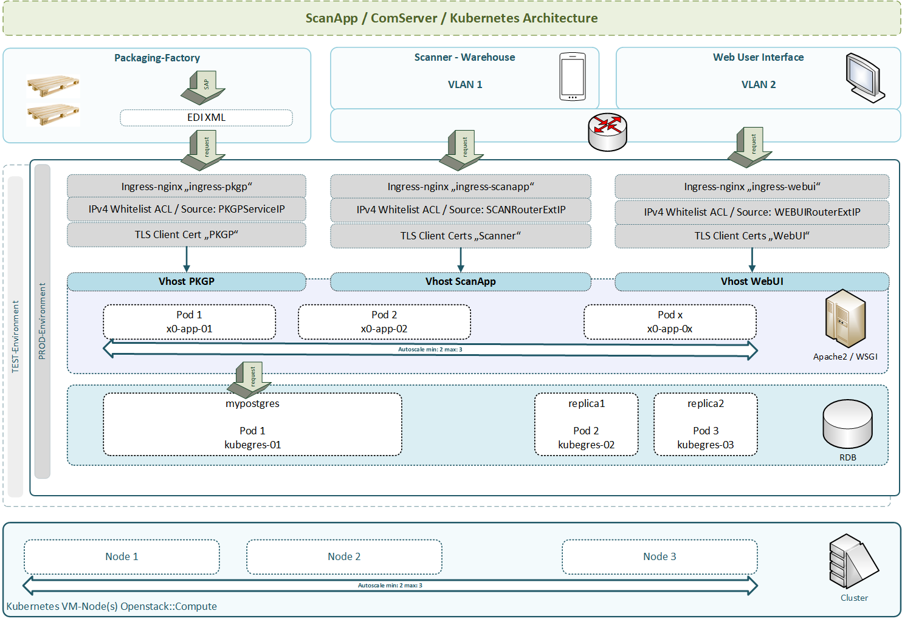

.. dev-architecture

.. _devarchitecture:

16. System Architecture
=======================

The current chapter introduces the **developer-documentation** part.
The first chart shows an overall view of global systems inter-communication.

.. image:: images/x0-architecture-overview.png
  :alt: image - architecture overview

16.1. Global Workflows
----------------------

- Initialization (Browser Page Load)

16.1.1. Init Logical
********************

.. image:: images/x0-workflow-init-nonuml.png
  :alt: image - architecture init workflow no-uml

16.1.2. Init UML Sequence
*************************

.. image:: images/x0-workflow-init-uml1.png
  :alt: image - architecture init workflow uml

16.2. Kubernetes Platform
-------------------------

The following chart illustrates an x0-generated GKE (Google Kubernetes Engine)
network environment for a demo application, initialized by the *x0-kubernetes-installer*.

The primary purpose of the application is to manage large-scale industrial
packaging systems and warehouse relations.

The application is divided into three sub-parts / environments:

1. Packaging Factory (EDI - SAP systems interconnect)
2. Warehouse Android Scanner Devices
3. Web Administration / Application Control Plane

