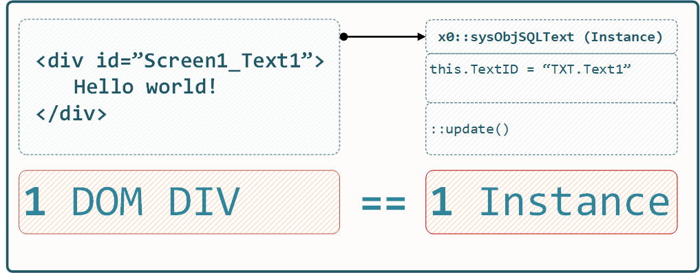

.. intro

1. Preface / Abstract
=====================

*x0* (cross-object) JavaScript Framework /krɒs ɒb.dʒɪkt/ is a modern tool for
efficiently building powerful Web-Browser **Realtime-SPA (Single Page Applications)**.

.. note::

    See :ref:`targetgroup` to understand which target group the *x0-system* is
    intended for.

1.1. Cross Objects
------------------

The *x* in *x0* stands for **cross**, signifying **communication**.
*x0-objects* can exchange (update) their metadata **directly** via
JSON, either internally or over a network.

1.2. Bootstrap / CSS Themes
---------------------------

*x0-system* includes the latest Bootstrap 5.3 basic CSS stylesheets
without relying on any JavaScript code (**Zero Bootstrap JS**).

Imagine *x0* as a system that enhances Bootstrap with **intelligent**
JavaScript logic based on **true OOP principles**.

Additionally, extending CSS styles with your own custom stylesheets
can be accomplished in just a few minutes.

1.3. Fontawesome
----------------

Fontawesome 6 Free is integrated into the *x0 base* system, providing an easy
way to use **high-quality icons**.

1.4. CSS Grid System
--------------------

To ensure future-proof **responsiveness**, *x0-system* offers smart libraries
for building advanced **device-independent** applications, leveraging
Bootstrap's Grid feature.

For more details on the Bootstrap Grid system, visit:
https://getbootstrap.com/docs/5.3/layout/grid/.

1.5. Browser Compatibility
--------------------------

*x0-system* is built in a **generic** way (using ECMA 6 and 7 standards),
enabling it to run natively on all modern browsers, including Firefox, Chrome,
Opera, and Safari.

1.6. Multi-language Support
---------------------------

*x0-system* supports **multi-language** functionality (currently English and
German). The display language can even be switched in **real-time** without
requiring a page reload.

1.7. Docker Images
------------------

Pre-built Docker images are available to get started with *x0-system* quickly:

- https://docker.webcodex.de/x0/docker.x0-app.tar
- https://docker.webcodex.de/x0/docker.x0-db.tar
- https://docker.webcodex.de/x0/docker.x0-test.tar

See :ref:`installation` for instructions on how to proceed.

1.8. Kubernetes
---------------

*x0-applications* can also be deployed on (load-balanced) Google Kubernetes Engine
(GKE), with native support integrated into the *x0-system*.

For more details, visit: https://github.com/WEBcodeX1/x0/blob/main/kubernetes/README.md.

1.9. Licensing
--------------

*x0-base-system* is licensed under the Open Source AGPLv3 license.

Certain components, including the WYSIWYG Editor, will be offered as **non-free**.

1.10. Milestones
----------------

For the current milestones, see: https://github.com/WEBcodeX1/x0/milestones.

.. _targetgroup:

1.11. x0 Target Group
---------------------

The following subsections describe the *x0-system's* **technical advantages**
and identify the **target group** for which the system is intended.

1.11.1. Div 2 Object Mapping
****************************

Consider the following example of one of the simplest *x0-system-objects*:
**SQLText**, which is configured to fetch text by ID from the backend and display
it in the currently selected language (English or German).

The *x0-system* **always** associates **one single** *JavaScript Object Instance*
with a single (rendered) DOM DIV, maintaining a strict 1:1 relationship. There will
be no DOM DIVs without a connected *JavaScript Object Instance*.

For example, if a rendered *x0-screen* contains 187 DIVs, then 187 corresponding
*JavaScript Object Instances* will be created by the *x0-system* during *x0-app-start*
(browser page load).

Each object also retains information about its **parent object** as well as the
base rendering routines (inherited from *x0-base-classes*).

.. note::

    More complex objects may consist of multiple (far more) DIVs. Check the
    developer section for details on designing *x0-system-objects* at
    :ref:`devobjectmodeling`.

1.11.2. True DOM OOP
********************

The *x0-system's* **DIV2ObjectMapping** method enables true OOP-based DOM DIV
modeling and manipulation for developers.

.. note::

    This feature allows the creation of highly powerful, enhanced, and
    **combined** *x0-system-objects* (details in the next section).

Continuing the SQLText example from the previous section:

The *x0-system* creates an SQLText object instance with the TextID "Text1"
defined in `object.json`. Its `update()` method can be called externally to update
the display text (DIV) to the currently selected system language in **real-time**.

.. code-block:: javascript

    sysFactory.getObjectByID("Text1").update();

Developers are also provided with the following capabilities:

- Redirecting Events
- Object Callbacks
- Web-Service Data Source Binding

1.11.3. Object Combination
**************************

One of the **most remarkable features** of the *x0-system* is its ability
to combine (chain) existing objects into new ones.

For example, defining a new object **SelfDefinedObject** can be done like this
(very simplified, invalid JavaScript syntax):

.. code-block:: javascript

    this.addObject(new SQLTextObj(TextID='TXT.DISPLAY'));
    this.addObject(new Formfield(Type='Pulldown', Options=['Option1', 'Option2']));

Once defined, the **SelfDefinedObject** can be reused in the same way to
define other new objects:

.. code-block:: javascript

    this.addObject(new SelfDefinedObject(Config));

.. note::

    For detailed information on designing and integrating *x0-system-objects*, see
    the developer documentation subsection :ref:`devobjectmodeling`.
